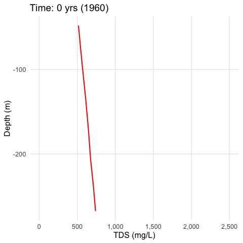

# Anthropogenic Basin Closure and Groundwater Salinization: An Unrecognized Threat to Water Quality Sustainability

Authors: Rich A. Pauloo [a], Graham E. Fogg [a], Thomas Harter [a], Zhilin Guo [b]

[a] University of California, Davis, Hydrologic Sciences, One Shields Avenue, Davis, CA 95616  
[b] Environmental Science and Engineering, South University of Science and Technology of China, 1088 Xueyuan Ave, Nanshan Qu, Shenzhen Shi, Guangdong Sheng, China, 518055

This repository contains scripts and data related to the publication *"Anthropogenic Basin Closure and Groundwater Salinization: An Unrecognized Threat to Water Quality Sustainability".*


  

Groundwater TDS-depth profile across a grid of timesteps. The red line represents the average TDS at the specified depth, and the width of the grey interval represents the 5th and 9th percentiles of the distribution of TDS output from the 1,000 model run ensemble.  

# Contents

`/archive` contains archived, deprecated versions of the model  
`/code` contains the mixing cell model written in R  
`/data` contains data and objects to run the model  
`/results` contain the graphs produced by the model  


## Getting Started 

1. Clone this repository  
2. Install [R](https://www.r-project.org/) and [RStudio](https://www.rstudio.com/)  
3. Open `MCMM.R` in Studio. An R Markdown (`.Rmd`) file is a notebook version of an R file ([more details here](https://rmarkdown.rstudio.com/))  
4. Run the code to evaluate the model  


## Contents

The model depends on 4 input files, found in `data`  
 - `boundary_dat.rds` - initial TDS-depth profile    
 - `GW.csv` - C2VSim 40 year groundwater budget  
 - `LB.csv` - C2VSim 40 year Land Zone budget  
 - `RZ.csv` - C2VSim 40 year Root Zone budget  
 
Model results are summarized into 3 plots and printed as PDF files by the model script `MCMM.R`. It is necessary to uncomment the lines of code that write these PDFs. To obtain the actual arrays of model output, it is necessary to run the model to bring these objects into memory.  


## Notes  
 - The 40 year period for all data is from 1961-10-31 : 2001-09-30, and begins on October, the start of the water year.  
 - Water budgets are derived from [C2VSim Version 3.02-CG (R374)](http://baydeltaoffice.water.ca.gov/modeling/hydrology/C2VSim/index_C2VSIM.cfm)  

## Software

We use R for all analysis related to this project. The development environment used to run the well failure model is shown below:  

```
> sessionInfo()
R version 3.6.0 (2019-04-26)
Platform: x86_64-w64-mingw32/x64 (64-bit)
Running under: Windows 10 x64 (build 17134)

Matrix products: default

locale:
[1] LC_COLLATE=English_United States.1252 
[2] LC_CTYPE=English_United States.1252   
[3] LC_MONETARY=English_United States.1252
[4] LC_NUMERIC=C                          
[5] LC_TIME=English_United States.1252    

attached base packages:
[1] grid      stats     graphics  grDevices utils     datasets 
[7] methods   base     

other attached packages:
[1] tidyr_0.8.3    gridExtra_2.3  ggplot2_3.2.0  scales_1.0.0  
[5] extrafont_0.17 dplyr_0.8.1   

loaded via a namespace (and not attached):
 [1] Rcpp_1.0.1        pillar_1.4.1      compiler_3.6.0   
 [4] remotes_2.0.4     prettyunits_1.0.2 tools_3.6.0      
 [7] testthat_2.1.1    pkgload_1.0.2     digest_0.6.19    
[10] pkgbuild_1.0.3    memoise_1.1.0     tibble_2.1.3     
[13] gtable_0.3.0      pkgconfig_2.0.2   rlang_0.3.4      
[16] cli_1.1.0         rstudioapi_0.10   Rttf2pt1_1.3.7   
[19] withr_2.1.2       fs_1.2.7          desc_1.2.0       
[22] devtools_2.0.2    rprojroot_1.3-2   tidyselect_0.2.5 
[25] glue_1.3.1        R6_2.4.0          processx_3.3.0   
[28] sessioninfo_1.1.1 purrr_0.3.2       callr_3.2.0      
[31] extrafontdb_1.0   magrittr_1.5      usethis_1.5.0    
[34] backports_1.1.4   ps_1.3.0          assertthat_0.2.1 
[37] colorspace_1.4-1  lazyeval_0.2.2    munsell_0.5.0    
[40] crayon_1.3.4
```


## Contact

Please contact me at **rpauloo at ucdavis dot edu** or **richpauloo at gmail dot com** with any questions.   
