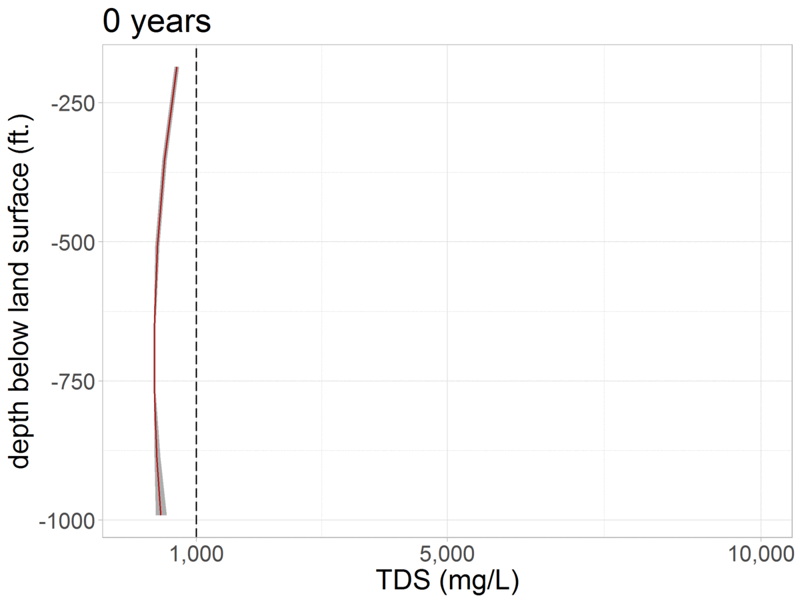

# Mixing Cell Model of Solute Transport in the Tulare Basin, California  

Created July 7, 2017 by Rich Pauloo at the University of California Davis   

  

Groundwater TDS-depth profile across a grid of timesteps. The red line represents the average TDS at the specified depth, and the width of the grey interval represents the 5th and 9th percentiles of the distribution of TDS output from the 1,000 model run ensemble.  

***  

## Getting Started 

1. Clone this repository  
2. Ensure you have [R](https://www.r-project.org/) and [RStudio](https://www.rstudio.com/) installed on your machine.  
3. Open MCMM_no_RWI.Rmd in Studio. An R Markdown (`.Rmd`) file is a notebook version of an R file ([more details here](https://rmarkdown.rstudio.com/)), and must be run in RStudio.   
4. Run the code to evaluate the model.  

## Contents

The model depends on 4 input files, found in `data`  
 - `boundary_dat.rds` - initial TDS-depth profile at $t_0$  
 - `GW.csv` - C2VSim 40 year groundwater budget  
 - `LB.csv` - C2VSim 40 year Land Zone budget  
 - `RZ.csv` - C2VSim 40 year Root Zone budget  
 
Results are summarized into 3 plots and printed by the model as PDF files into `results`. To obtain the actual arrays of model output, it is necessary to run the model to bring these objects into memory.  

The `archive` folder contains old scripts related to the model that are kept for posterity and reference.  
 
***  

## Notes  
 - The 40 year period for all data is from 1961-10-31 : 2001-09-30, and begins on October, the start of the water year.  
 - Water budgets are derived from [C2VSim Version 3.02-CG (R374)](http://baydeltaoffice.water.ca.gov/modeling/hydrology/C2VSim/index_C2VSIM.cfm)  

***  

## Contact

Please contact me at **rpauloo at ucdavis dot edu** or **richpauloo at gmail dot com** with any questions.   